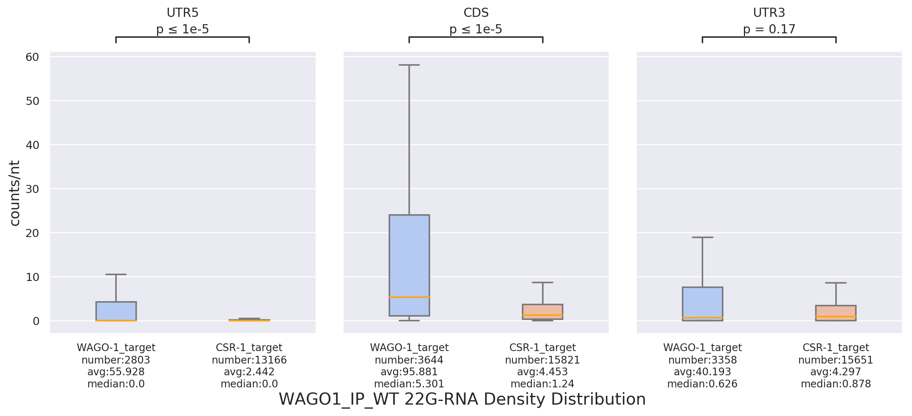
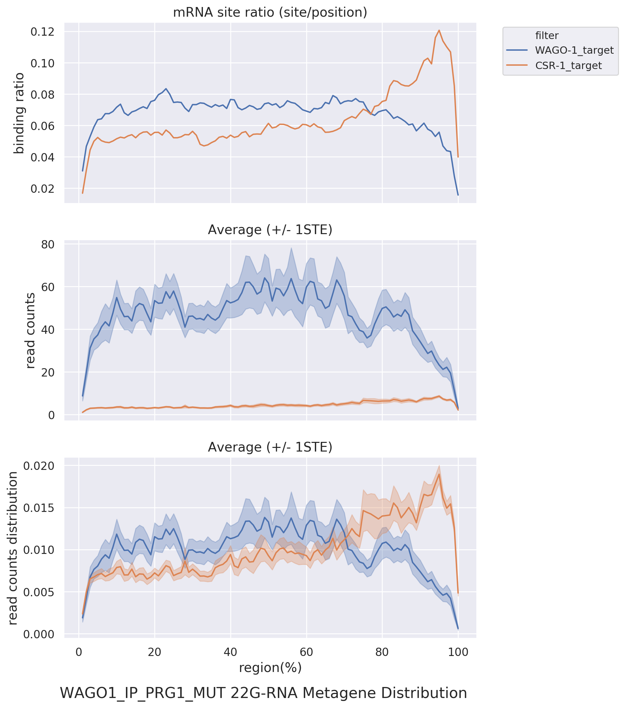
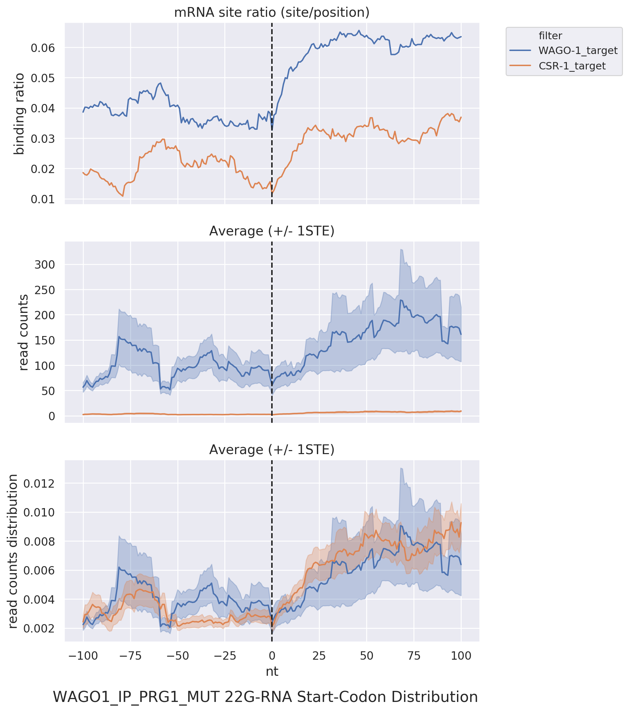
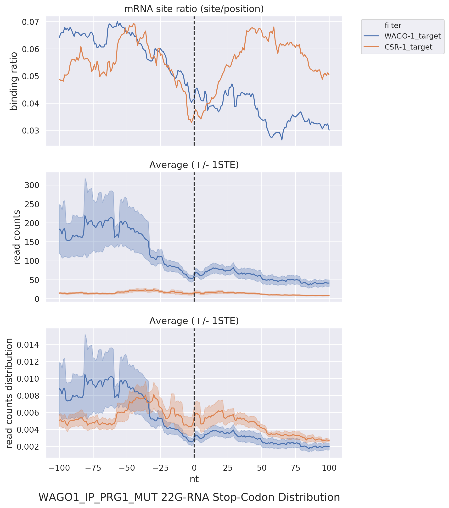
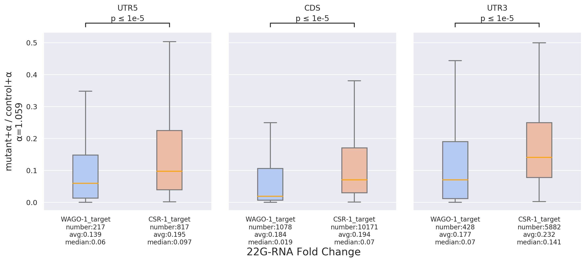
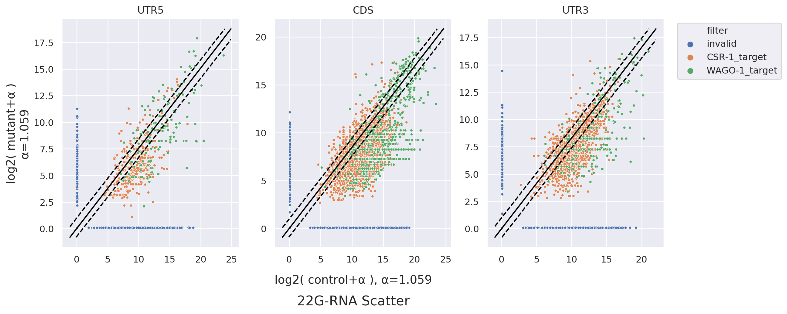

# sRNAanalyzer
> A Comprehensive Tool for In-depth Analysis of sRNA-seq Data across Species, Conditions, and Target Genes

## Main Features:
### Universal Preprocessing Tool:
- Provides a versatile preprocessing tool that seamlessly integrates with various utilities such as Cutadapt and Bowtie, enabling the construction of customized preprocessing workflows.

### Downstream Analysis Tool:
- Facilitates transcriptome-wide examination of NGS sequences under specific gene lists using several downstream analysis tools.

> This version incorporates numerous improvements in performance and architecture, including the addition of a new preprocessing workflow. For information on the previous version and related research paper, please refer to the [RDT](https://github.com/RyanCCJ/RDT) project.

## Downstream Tools:
1. **Density Distribution:** Enables observation of distribution across different regions, facilitating the comparative analysis of results across different conditions and target genes.  
   

2. **Metagene Distribution:** Allows the overlay of target genes for an overview of their collective distribution patterns.  
   

3. **Position Distribution:** Facilitates observation of distribution around specific positions, currently including boundaries and start/stop codons.  
   <div>
   
   
   </div>

4. **Fold-change Plot:** Permits the examination of the magnitude of changes between two conditions within different regions.  
   

5. **Scatter Plot:** Enables the observation of the relative distribution of two conditions within different regions.  
   

## Getting Started:
```sh
# download this project
git clone https://github.com/RyanCCJ/sRNAanalyzer.git
cd sRNAanalyzer

# an example of c.elegans 22G-RNAs is provided
cd example/script/

# perform preprocessing and generate various intermediate files
sh 22G_preprocess.sh

# perform downstream analysis and generate various analysis graphics
sh 22G_analyze.sh
```
**Note:** The examples in this project require approximately **530GB** of disk space. Please ensure you have sufficient space for operations. Alternatively, you can download only the source code and configuration files, then refer to the relevant [doc]() for manual setup.

## Web Tool:

If you prefer a quick trial, you can explore our [web tool](https://cosbi7.ee.ncku.edu.tw/sRNAanalyzer/).

1. **Preprocess Page:**
- Provides a user-friendly workflow for customizing preprocessing steps.
- Users can utilize our universal tool to achieve specific effects.

2. **Analysis Page:**
- Integrates various downstream analysis tools.
- Users can input experimental or literature data, or selectively input a target list of interest for further analysis.

3. **Database Page:**
- Includes literature data such as NGS raw-read, reference, and a portion of the nematode target list for reference.

**Note:** All uploaded data and analysis results will be retained for only **3 days**. Please make sure to record your job ID. If you have additional requirements, consider exploring our [Docker version]().

## Documentation
To see full documentation, please check this project's [wiki](https://github.com/RyanCCJ/sRNAnalyzer/wiki).

## Requirements
- Python >= 3.5
- numpy >= 1.12
- seaborn >= 0.9
- matplotlib >= 2.2
- pandas >= 0.23
- pysam >= 0.20
- scipy >= 1.1
- tqdm >= 4.0
- PyYAML >= 5.3
- statannot = 0.2.3  
(Please refer to the [doc]() for some important considerations.)

## LICENSE
Please refer to our [MIT license](https://github.com/RyanCCJ/sRNAnalyzer/blob/master/LICENSE).
