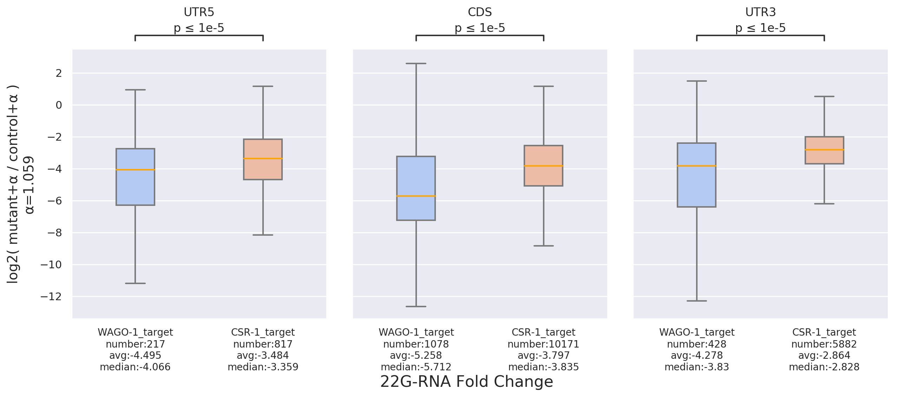

# sRNAanalyzer: A Comprehensive Web Tool for In-depth Analysis of sRNA-seq Data across Species, Conditions, and Target Genes

## Main Features:
1. **Universal Preprocessing Tool:**
   - Provides a versatile preprocessing tool that seamlessly integrates with various utilities such as Cutadapt and Bowtie, enabling the construction of customized preprocessing workflows.

2. **Downstream Analysis Tool:**
   - Facilitates transcriptome-wide examination of NGS sequences under specific gene lists using several downstream analysis tools.

## Downstream Tools:
1. **Density:**
   - Enables observation of distribution across different regions, facilitating the comparative analysis of results across different conditions and target genes.
   

2. **Metagene:**
   - Allows the overlay of target genes for an overview of their collective distribution patterns.
   

3. **Position:**
   - Facilitates observation of distribution around specific positions, currently including boundaries and start/stop codons.
   

   
   
   

4. **Fold-change:**
   - Permits the examination of the magnitude of changes between two conditions within different regions.
   

5. **Scatter:**
   - Enables the observation of the relative distribution of two conditions within different regions.
   

## Getting Started:

### Download the Project:
Download the project from: [https://github.com/RyanCCJ/RDT.git](https://github.com/RyanCCJ/RDT.git)

**Note:** The examples in this project require approximately 530GB of disk space. Please ensure you have sufficient space for operations. Alternatively, you can download only the source code and configuration files, then refer to the relevant documentation for manual setup.

1. Enter the `example/` directory, where an example analysis of c.elegans 22G-RNA is provided.

2. Navigate to the `script/` directory and execute `22G_preprocess.sh` to perform preprocessing and generate various intermediate files.

3. In the `script/` directory, execute `22G_analyze.sh` to perform downstream analysis and generate various analysis graphics.

### Example Results:
... (Provide information and details about the example results here.)

## Web Tool:

If you prefer a quick trial, you can explore our [web tool](https://cosbi7.ee.ncku.edu.tw/sRNAanalyzer/).

### Preprocess Page:
- Provides a user-friendly workflow for customizing preprocessing steps.
- Users can utilize our universal tool to achieve specific effects.

### Analysis Page:
- Integrates various downstream analysis tools.
- Users can input experimental or literature data, or selectively input a target list of interest for further analysis.

### Database Page:
- Includes literature data such as NGS raw-read, reference, and a portion of the nematode target list for reference.

**Note:** All uploaded data and analysis results will be retained for only "three days." Please make sure to record your job ID. If you have additional requirements, consider exploring our [Docker version]().

## Documentation
To see full documentation, please check this project's [wiki](https://github.com/RyanCCJ/sRNAnalyzer/wiki).

## Requirements
Python >= 3.5
numpy >= 1.12
seaborn >= 0.9
matplotlib >= 2.2
pandas >= 0.23
pysam >= 0.20
scipy >= 1.1
tqdm >= 4.0
PyYAML >= 5.3
statannot = 0.2.3 (Please refer to the [documentation]() for some important considerations.)

## LICENSE
Please refer to our [MIT license](https://github.com/RyanCCJ/sRNAnalyzer/blob/master/LICENSE).
